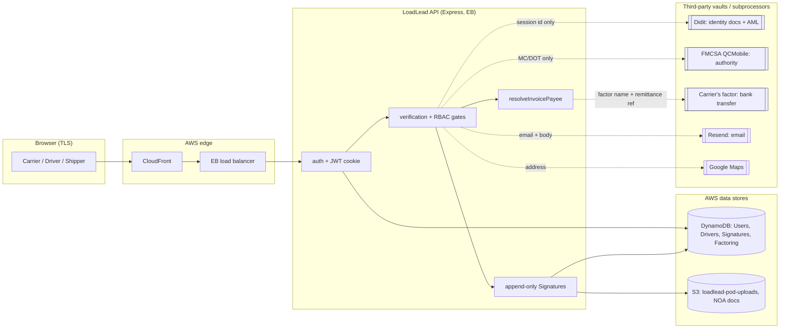

# 02 Data Flow Map

Run date: 2026-06-28. Commit `2054ab2`. Read-only.

## Stack and front door (Phase 0 recon)

- Backend: Node, Express 4, TypeScript. Entry `backend/src/index.ts`. Data in
  AWS DynamoDB (`backend/src/config/database.ts`), documents and photos in S3.
- Frontend: React 18 + Vite 5 in `frontend-v2/` (two SPA bundles, customer and
  admin). API base `VITE_API_URL`.
- Host: AWS. API on Elastic Beanstalk, SPAs on S3 + CloudFront.
- Edge: CloudFront, then the EB load balancer. CORS allowlist at
  `backend/src/index.ts:126-135`. Auth rate limit on `/api/auth/*` at
  `index.ts:207`.

## Third-party egress and inbound (trust boundaries)

| Direction | Party | What crosses | Evidence |
|---|---|---|---|
| Egress | Didit | Creates a hosted IDV session; identity documents go to Didit, not to me | `backend/src/services/integrations/didit.ts:19,23` |
| Egress | FMCSA QCMobile | MC / DOT number for an authority check; returns boolean | `backend/src/services/integrations/fmcsa.ts:33,42` |
| Egress | Google Maps | Address / lat-lng for geocoding and distance | `backend/src/services/integrations/maps.ts` |
| Egress | Resend | Recipient email + message body (transactional, beta, staff invites) | `backend/src/services/integrations/email.ts` |
| Egress | AWS S3 | POD photo bytes, NOA documents | `backend/src/services/attestation/podPhotoService.ts:58` |
| Inbound | Tally | Beta application form payload (PII), HMAC-verified | `backend/src/routes/tallyWebhook.ts` |
| Inbound | Didit | IDV result webhook | `backend/src/index.ts` mount `POST /api/webhooks/didit` |

## Sensitive flow narrative

Carrier identity. The browser starts verification, the API calls Didit to mint
a hosted session (`didit.ts:23`), and the carrier completes IDV on Didit. The
documents never touch my servers. Didit calls back via webhook; I record only
the five-state `idvStatus` (`types/index.ts:124`). This is the single most
important trust-boundary design choice: the toxic data class lives in a vault I
do not operate.

Carrier authority. At verification, the API sends the MC or DOT number to FMCSA
QCMobile and receives a boolean (`fmcsa.ts:17,49`). Note the fail-open branch:
if `FMCSA_WEBKEY` is unset in live mode the check returns true
(`fmcsa.ts:35-36`). That is a Processing Integrity weakness, ranked in
`04-gap-analysis.md`.

Funds flow. When an invoice payee is resolved, `resolveInvoicePayee` returns
`FACTOR` if the load has a `SUBMITTED` factoring opt-in, otherwise `CARRIER`
resolved through carrier-of-record (`factoring.ts:171-184`). No raw bank
details enter the system; the factor (off platform) moves the money. The data I
hold is a factor name, a NOA key, and a remittance reference
(`factoringProfile.ts:81`).

Signature and POD chain. Signatures are written to an append-only table whose
mutation is blocked by lint (`attestation/.eslintrc.cjs:22-31`). POD photo bytes
go to S3 `loadlead-pod-uploads`, metadata to DynamoDB (`podPhotoService.ts:47,58,66`).

## Mermaid: sensitive flows and trust boundaries

The dotted edges are trust-boundary crossings. The three boxes shaded as vaults
(Didit, FMCSA, the carrier's factor) are where the most sensitive classes
already live off platform, which is the foundational-layer goal.
