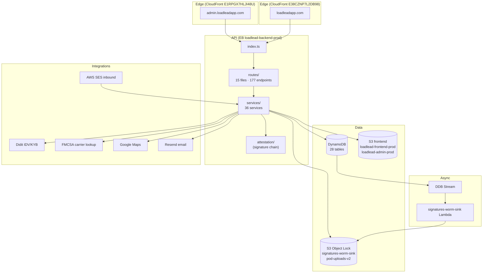
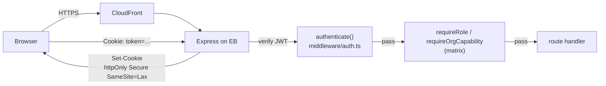
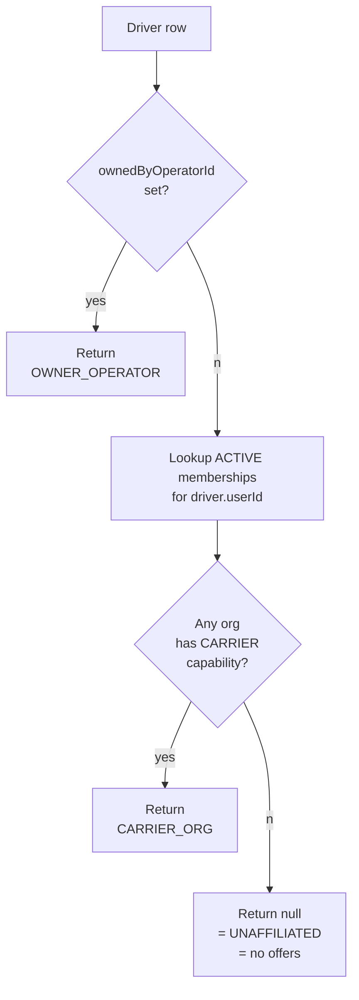
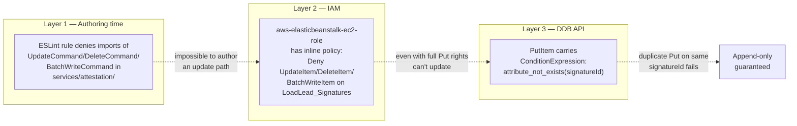
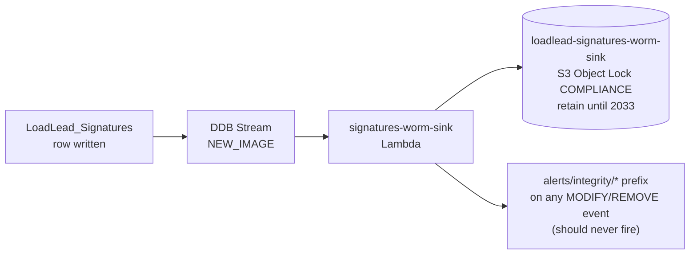
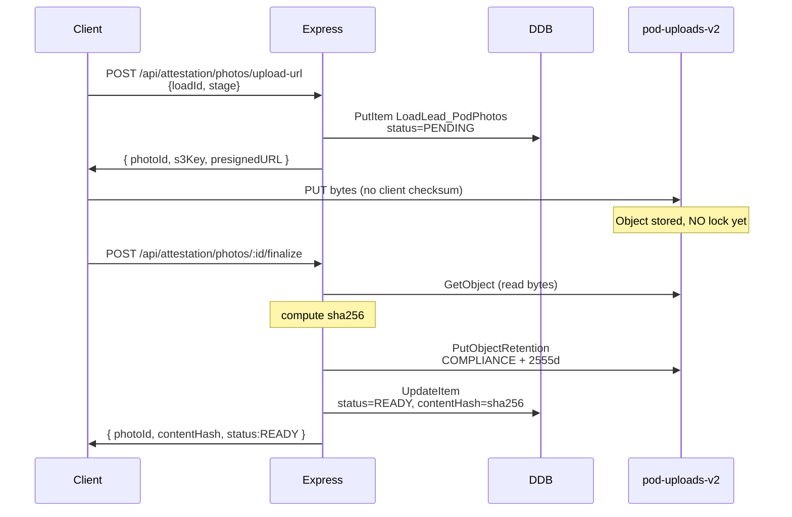

# Backend Architecture

> Every subsystem carries a status badge: ✅ Done · 🟡 Partial · 🟠 Pending · ⚪ Not started. Each Done badge cites a file/route/test. Each non-Done points at the entry in [`PendingRegister.md`](PendingRegister.md).

## Stack ✅ Done

| Layer | Choice | Evidence |
|---|---|---|
| Runtime | Node.js 22 on AWS Elastic Beanstalk (AL2023) | EB env `loadlead-backend-prod`, platform `64bit Amazon Linux 2023 v6.11.1 running Node.js 22` |
| Language | TypeScript (strict) | `backend/tsconfig.json` |
| Web framework | Express 5 | `backend/src/index.ts` |
| Database | DynamoDB (28 prod tables, all PAY_PER_REQUEST, all PITR) | `infra/terraform/envs/prod/imported-tables.tf` + `main.tf` |
| Object storage | S3 — 5 buckets, 2 WORM | `infra/terraform/envs/prod/{worm-sink,pod-uploads-v2,frontend-buckets-imported}.tf` |
| Auth | JWT in httpOnly cookies | `backend/src/middleware/auth.ts` |
| Tests | Vitest — 266 cases, 0 failures | `backend/tests/` (unit + security + reliability + contract) |

## High-level component map ✅ Done

## Routes ✅ Done

**177 total routes across 15 files.** Auth coverage: 156 / 177 = 88.1% authenticated; 21 truly public.

| File | Routes | File-level auth | Notes |
|---|---|---|---|
| `routes/admin.ts` | 23 | ✅ | Internal staff console |
| `routes/attestation.ts` | 4 | ✅ | Sign + photo + chain read |
| `routes/auth.ts` | 14 | mixed | 7 pre-auth (login/signup/etc), 7 inline-auth |
| `routes/bol.ts` | 8 | ✅ | Bill of lading lifecycle |
| `routes/driver.ts` | 25 | ✅ | Driver loadboard + lifecycle |
| `routes/factoring.ts` | 10 | ✅ | Carrier factoring opt-in |
| `routes/maps.ts` | 3 | 🟠 **NONE** — see [PR-1](PendingRegister.md#high) | Google Maps quota exposure |
| `routes/notifications.ts` | 7 | ✅ | In-app inbox |
| `routes/org.ts` | 24 | ✅ | Org membership + IAM + dispatch |
| `routes/ownerOperator.ts` | 18 | ✅ | OO self-haul + fleet |
| `routes/receiver.ts` | 6 | ✅ | Inbound + RECEIVER_CONFIRM |
| `routes/reference.ts` | 8 | public (intentional) | Taxonomy lookups |
| `routes/setup.ts` | 3 | public (intentional) | Admin bootstrap (single-use token) |
| `routes/shipper.ts` | 12 | ✅ | Post-load + track |
| `routes/support.ts` | 11 | ✅ | Internal support inbox |

The full method/path/guard table is in [`Data_API_Reference.md`](Data_API_Reference.md). Generated from `backend/src/routes/*.ts` on every reconciliation pass; the script is `docs/.build/route_inventory.json`.

## Auth + session ✅ Done

| Property | Value | Evidence |
|---|---|---|
| Token type | JWT (HS256) | `backend/src/middleware/auth.ts` |
| Transport | httpOnly cookie, `Secure`, `SameSite=Lax` | `backend/src/middleware/auth.ts` issue/clear logic |
| Refresh | Single-token (no refresh-token rotation yet) | Limitation noted in `STIG LL-SM-002` (Not Reviewed) |
| Logout | Cookie cleared; **no server-side denylist** | `STIG LL-SM-003` — gap if reuse-after-logout is a threat |
| Auth gate | `router.use(authenticate)` at file top (11/15 files) | grep `router\.use\(authenticate\)` in `backend/src/routes/*.ts` |
| Public-by-design routes | 21: 7 in auth.ts (signup/login/etc), 8 in reference.ts (taxonomy), 3 in setup.ts (admin bootstrap), 3 in maps.ts (🟠 see PR-1) | docs/.build/route_inventory.json |

## Carrier-of-record resolver ✅ Done

Three legitimate carriers-of-record:
- **Owner Operator** — driver.ownedByOperatorId set (OO self-driver: ownedByOperatorId === own operatorId)
- **Carrier organization** — first ACTIVE membership in an org with CARRIER capability
- **None** — UNAFFILIATED driver; cannot accept loads; surfaces as the "Awaiting affiliation" banner in the driver UI

| Property | Status | Evidence |
|---|---|---|
| Resolver implementation | ✅ Done | `backend/src/services/carrierOfRecord.ts:resolveCarrierOfRecord` |
| Used by acceptance gate | ✅ Done | `requireVerifiedCarrier()` in `backend/src/services/verification.ts` |
| Used by `/api/driver/affiliation` (the UI signal) | ✅ Done | `backend/src/routes/driver.ts:/affiliation` + tests in `tests/security/driverAffiliation.test.ts` |
| Tests | ✅ Done | `tests/unit/carrierOfRecord/resolve.test.ts` + `tests/unit/org/selfHaulAndOnboarding.test.ts` |

## Verification (two gates) ✅ Done

Every driver acceptance passes through **two independent verification gates**:

1. **Authority** — the carrier-of-record's `LoadLead_Verifications` row must be `VERIFIED` (FMCSA active + KYB passed via Didit, for OO/Carrier orgs)
2. **Identity** — the driver themselves must have `idvStatus=VERIFIED` (personal IDV via Didit)

Both must clear. An OO with passed KYB who hasn't done personal IDV still can't accept loads (they're acting as their own driver).

| Property | Status | Evidence |
|---|---|---|
| Server-side enforcement | ✅ | `backend/src/services/verification.ts:requireVerifiedCarrier()` |
| Per-user IDV (not per-org duplication) | ✅ | `User.idvStatus`; Didit webhook updates the user row, not the org |
| Webhook HMAC verification | ✅ | `backend/src/routes/diditWebhook` (mounted in index.ts) |
| Webhook idempotency | ✅ | Conditional write on the Verifications row; double-fire is rejected |
| Tests | ✅ | `tests/unit/verification/gates.test.ts`, `deriveStatus.test.ts` |

## Attestation / signature chain ✅ Done — three-layer immutability

The five lifecycle signatures (`BOL_SUBMIT` / `CARRIER_ACCEPT` / `DRIVER_PICKUP` / `DRIVER_DELIVER` / `RECEIVER_CONFIRM`) are stored as append-only rows in `LoadLead_Signatures`. Three independent layers prevent mutation:

Plus a **fourth, independent layer**:

| Property | Status | Evidence |
|---|---|---|
| Signature service uses only PutItem | ✅ | `backend/src/services/attestation/signatureService.ts`; ESLint config at `services/attestation/.eslintrc.cjs` |
| IAM Deny on Update/Delete/BatchWrite | ✅ | Applied out-of-band via `scripts/attestation-bootstrap-ops.sh`; TF module `infra/terraform/modules/iam_signatures/` |
| Conditional PutItem | ✅ | `attribute_not_exists(signatureId)` in `signatureService.ts:recordSignature` |
| Wrapped DDB error | ✅ | `ConditionalCheckFailedException` → AppError `SIGNATURE_DUPLICATE` 409 |
| WORM sink Lambda | ✅ | `infra/terraform/envs/prod/lambda/signatures-worm-sink/index.mjs` |
| Object Lock COMPLIANCE on sink | ✅ | 2555-day default retention; verified via `aws s3api get-object-lock-configuration` |
| Bucket policy denies DeleteObject | ✅ | `infra/terraform/envs/prod/worm-sink.tf:signatures_worm_no_delete` |
| Per-action canonical projection | ✅ | `backend/src/services/attestation/projections/v1.ts` (JCS-style sorted-key serialization) |
| `documentHash` = sha256 of canonical | ✅ | `backend/src/services/attestation/canonicalize.ts` |
| Resolver-based signer authZ | ✅ | `backend/src/services/attestation/assertSignerIsLoadParty.ts` |
| Chain READ authZ (admin || party) | ✅ | `assertChainReadAccess()` in same file; tested in `tests/unit/attestation/chainReadAccess.test.ts` |
| `correctsSignatureId` field plumbed | ✅ | Persisted on the row; tested in `tests/reliability/signatureReplayProtection.test.ts` |
| `correctsSignatureId` UI | 🟡 | No admin surface yet — see [PR-6](PendingRegister.md#medium) |

## Proof photos (POD) ✅ Done — Object Lock per-object

| Property | Status | Evidence |
|---|---|---|
| Bucket Object Lock enabled at creation | ✅ | `infra/terraform/envs/prod/pod-uploads-v2.tf` |
| Bucket policy denies DeleteObject | ✅ | `pod_uploads_v2_no_delete` |
| Server-applied per-object retention | ✅ | `backend/src/services/attestation/podPhotoService.ts:finalizeUpload` |
| Synchronous finalize (server reads bytes) | ✅ | `finalizeUpload` reads + sha256s before signature accepts photoId |
| WRONG_FINALIZER guard | ✅ | Tested in `tests/security/podFinalizerBinding.test.ts` |
| Idempotency on re-finalize | ✅ | Tested in `tests/reliability/finalizeUploadIdempotency.test.ts` |
| Bytes migrated from v1 | ✅ | 3 e2e photos migrated; v1 read-only for back-references |

## Integrations ✅ Done

Boot-time mode resolver picks live vs stub per `APP_ENV` (production = live, dev/staging = stub by default).

| Integration | Use | Mode resolver | Status |
|---|---|---|---|
| Didit IDV/KYB | Identity + carrier authority verification | `backend/src/services/integrations/didit.ts` (live) + `didit.stub.ts` | ✅ |
| FMCSA carrier lookup | MC/DOT number validation | `services/integrations/fmcsa.ts` + `.stub.ts` | ✅ |
| Google Maps | Geocoding + distance | `services/integrations/maps.ts` + `.stub.ts` | ✅ |
| Resend | Outbound transactional email | `services/integrations/email.ts` | ✅ |
| AWS SES | Inbound email → support inbox | `services/supportInboundService.ts` | ✅ |
| Web Push | Driver push notifications | `services/integrations/push.ts` + `.stub.ts` | ✅ |

Production-locked boot guard at `backend/src/services/integrations/bootGuard.ts` — fails closed if `APP_ENV=production` and any integration is in stub mode.

## Data model — 28 DDB tables

All under Terraform management as of `d1a3ec6`. All have PITR enabled. Full schemas (hash key, range key, GSIs) in [`Data_API_Reference.md`](Data_API_Reference.md).

| Group | Tables | Status |
|---|---|---|
| **Critical (lifecycle)** | Users, Loads, Offers, Drivers, Shippers, Receivers, Organizations, Memberships, BOL, Verifications, Signatures, PodPhotos | ✅ Done — all 12 imported, all PITR, append-only on Signatures |
| **Secondary (support/admin)** | AdminAudit, AdminBootstrapAttempts, CarrierFactoringProfiles, FactoringOptIns, FleetInvites, Invitations, Notifications, OwnerOperators, PasswordResets, PushSubscriptions, SetupTokens, SupportInbound, SupportMessages, SupportSettings, SupportTickets, MembershipAuditLogs | ✅ Done — all 16 imported, all PITR (was disabled on all 16 pre-import, fixed in `d1a3ec6`) |

## Async / event-driven layer ✅ Done

| Source | Consumer | Purpose | Status |
|---|---|---|---|
| `LoadLead_Signatures` DDB Stream (NEW_IMAGE) | `signatures-worm-sink` Lambda | Mirror every signature row into the WORM S3 bucket | ✅ |
| `setInterval` worker (30s) | `BroadcastService.rebroadcastExpiredLoads` | Re-emit OPEN loads whose offers expired | ✅ (in-process worker on EB; moves to EventBridge in Phase 2) |
| Didit webhook | `routes/diditWebhook` | Updates Verifications row | ✅ HMAC-verified, idempotent |
| SES inbound | `supportInboundService` | Email → support ticket | ✅ |

## Observability ✅ Done — alarms wired

| Alarm | Source signal | Status |
|---|---|---|
| `worm_sink_errors` | Lambda Errors metric | ✅ |
| `worm_sink_throttles` | Lambda Throttles metric | ✅ |
| `worm_sink_iterator_age` | Lambda IteratorAge metric | ✅ |
| IAM Access Analyzer | Account-wide policy scan | ✅ |
| SNS topic | `loadlead-prod-ops-alerts` | ✅ (no subscriber yet — see [`PendingRegister.md`](PendingRegister.md)) |

PITR-state alarms (gap if it gets disabled out-of-band) are a follow-up in `PendingRegister.md` item #8.

---

## Reconciliation delta (prior pass → `2054ab2`) — Status: Partial→Done

Shipped since the last full pass; each verified against the route/service:

- **Private-beta gate** ✅ — `middleware/betaGate.ts` `requireBetaGate({mode:'signup'|'login'})`; `BETA_MODE` flag; ADMIN + `user.betaUser` exempt; fail-closed on DB error. Mounted on auth routes.
- **Beta program services** ✅ — `services/betaApplicationService.ts` (Tally ingest, field-label mapping, auto-qualify), `betaScoring.ts` (7-dim rubric), `betaAllowlistService.ts`, `waitlistService.ts`.
- **Tally webhook** ✅ — `routes/tallyWebhook.ts` mounted at `POST /api/admin/beta/webhook` with `express.raw()` before `express.json`; raw-body HMAC-SHA256 (`TALLY_SIGNING_SECRET`); idempotent by `responseId`; inert 503 when unconfigured.
- **Platform-staff IAM** ✅ — `types/platformRole.ts` (`PlatformRole` enum, separate from `OrgRole`), `services/staffService.ts`, `routes/adminStaff.ts`; gated by `requireStaffTier(...tiers)` (exact-match, `middleware/auth.ts:84`). Public `POST /api/admin/staff/accept-invite` validated separately.
- **Email** ✅ — `services/emailService.ts` via the Resend adapter (`integrations/email.ts`); transactional + beta/staff templates; sender domain `loadleadapp.com` verified.
- **New `/api` mounts** (`index.ts`): `/api/beta`, `/api/admin/beta`, `/api/admin/staff`, `/api/factoring`, `/api/reference`, `POST /api/webhooks/didit`.
