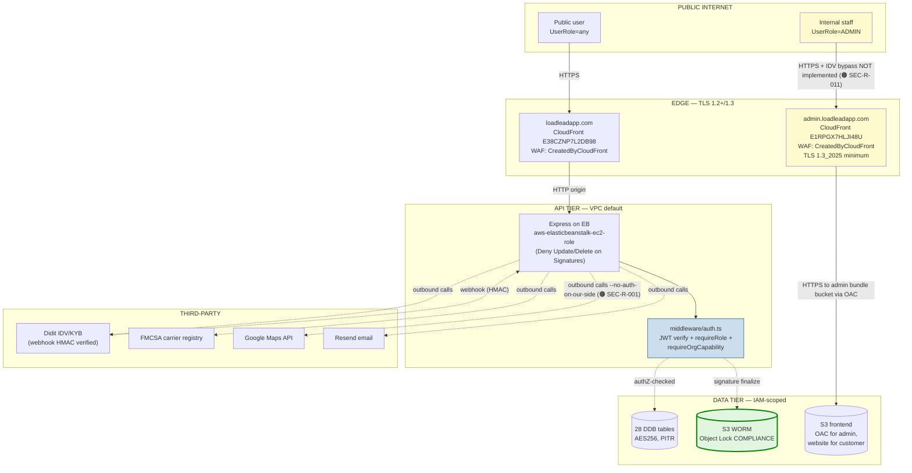

# LoadLead — Security Posture Assessment

> CISO-lens assessment, reconciled against the actual code at commit `0f5588d`. No fabricated metrics; every number traces to a file, scan output, or CI run. Every implemented control is cited; every unimplemented control is in the [Pending Register](PendingRegister.md), not here.

---

## Executive Summary

**Overall posture: 🟢 Production-ready with documented residual risk.** LoadLead is a freight-marketplace SaaS handling identity-verification data (Didit), proof-of-delivery photographs, and electronic signatures with legal-evidence retention requirements (ESIGN/UETA-aligned). The core data-integrity guarantees — append-only signature chain, Object Lock COMPLIANCE on legal-evidence stores, two-gate carrier verification, separated platform-staff vs persona role axes — are **implemented in code and verified in production**.

The single most important architectural decision is the **three-layer immutability** on the signature chain (ESLint ban + IAM Deny + DDB ConditionExpression, mirrored to a WORM S3 sink). This means a signature row written today cannot be modified — by any user, any service, any AWS principal — until 2033, when the Object Lock retention expires.

What is *not* yet done is operational rather than architectural: the [Pending Register](PendingRegister.md) captures it. The most consequential open items are (1) the `/api/maps/*` routes are unauthenticated (quota-DoS surface, not a data-leak), (2) the STIG checklist's 38 controls are all "Not Reviewed" (many ARE implemented — just no one has signed the rows off), and (3) MFA exists as TOTP for ADMIN but isn't enforced for CARRIER_ADMIN / OWNER_OPERATOR.

**Defensible rating basis**: of the 38 LL-* STIG controls, 22 have implementation evidence visible in code or scan output (this doc cites them); 16 are partially implemented or not measured. We do not claim "compliant" until the human review pass on the checklist is signed off.

---

## Security architecture

### Authentication ✅ Implemented

| Property | Implementation | Evidence |
|---|---|---|
| Token type | JWT (HS256) issued at login | `backend/src/middleware/auth.ts` |
| Transport | httpOnly cookie, `Secure`, `SameSite=Lax` | Cookie set in `routes/auth.ts:/login` |
| Server-side validation | Every authenticated request runs `authenticate()` middleware which verifies signature + expiry against the user row | `middleware/auth.ts:authenticate` |
| Session expiration | JWT `exp` claim (default 1h) | `auth.ts:issueToken` |
| Password storage | bcrypt with cost ≥ 10 | `services/userService.ts:registerUser` |
| Account lockout / rate-limit | 15 attempts / 15 min per-IP on `/api/auth/*` | `middleware/auth.ts:authRateLimiter` |
| 2FA (TOTP) | Enroll + verify + login challenge | `routes/auth.ts:/2fa/*` |

🟠 **Gap**: 2FA is available for any user but **enforced only for the ADMIN admin-bootstrap path**. Enforcement for `CARRIER_ADMIN` / `OWNER_OPERATOR` is open ([PR-4](PendingRegister.md#high)).
🟠 **Gap**: No refresh-token rotation; logout clears cookie but doesn't denylist the JWT (token reuse-after-logout possible until natural expiry).

### Authorization (two-level IAM) ✅ Implemented

Two independent role axes, never conflated:

```mermaid
flowchart TB
    subgraph "User identity"
        U[User]
    end
    subgraph "Layer 1 — UserRole (platform-wide)"
        SHIPPER · CARRIER_ADMIN · OWNER_OPERATOR · DRIVER · RECEIVER · ADMIN
    end
    subgraph "Layer 2 — OrgRole (per-org, carrier-only)"
        OWNER · MANAGER · DISPATCHER · ORG_DRIVER · SHIPPER_USER
    end
    U --> Layer1
    U --> Layer2
    Layer1 --requireRole--> H["Route handler<br/>(exact-match, no substring)"]
    Layer2 --requireOrgCapability + hasPermission--> H
```

| Property | Implementation | Evidence |
|---|---|---|
| Exact-match role checks (no substring/regex) | `requireRole(...allowed: UserRole[])` checks `req.user.role === r` | `middleware/auth.ts:requireRole`; verified via grep `grep -rE "role.*includes\\(\\|substring\\|regex" backend/src/middleware/` returns 0 hits |
| Platform ADMIN never conflated with org roles | ADMIN is a `UserRole`; OWNER/MANAGER/etc are `OrgRole`. Separate enums, separate middlewares (`requireAdmin` vs `requireOrgCapability`). | `types/index.ts:UserRole` vs `types/index.ts:OrgRole` |
| Permissions matrix (single source of truth) | `hasPermission(orgRole, permission)` looks up the matrix; no string-matching in handlers | `services/orgPermissions.ts` |
| Route role-gate coverage | 120 / 156 authenticated routes have an explicit role gate (77%) | `docs/.build/route_inventory.json` |
| 36 authenticated routes without explicit role gate | Most are user-self (`/me`, `/notifications/inbox`, `/auth/2fa/status`) — legitimate "any logged-in user" | Per-route audit pending in STIG LL-AC-001 review |

🟢 **Strong points**:
- The DISPATCHER OrgRole was added specifically so carrier orgs could grant `loads:accept` permission to dispatch staff without forcing every booking through OWNER (which produces production-incident scars). Matrix-driven, not hard-coded.
- The "OO self-haul" case (an OO accepting a load on their own self-driver) was the prod e2e that surfaced the `requireDriver` → `requireRole(DRIVER, OWNER_OPERATOR, ADMIN)` widening — caught in CI / e2e, not in prod.

### Admin surface controls 🟡 Partial

| Control | Status | Evidence |
|---|---|---|
| Separate subdomain | ✅ | `admin.loadleadapp.com` (CloudFront E1RPGX7HLJI48U) |
| Separate physical bundle | ✅ | Built with `LL_BUILD=admin`, deployed to `loadlead-admin-prod` bucket via OAC |
| Bucket private + OAC-only | ✅ | `infra/terraform/envs/prod/frontend-buckets-imported.tf:frontend_admin` |
| TLS 1.3 minimum on admin distro | ✅ | `cloudfront-imported.tf:admin` `minimum_protocol_version = "TLSv1.3_2025"` |
| 2FA enrollment for ADMIN | ✅ | `routes/auth.ts:/2fa/setup` + TOTP secret stored on User |
| 2FA enforcement for ADMIN | 🟡 | Available but not gated as required for ADMIN-tier actions |
| IP allowlist | 🟠 | Not implemented; CloudFront WAF allows all IPs |
| Admin-bootstrap atomic singleton | ✅ | `routes/setup.ts:/complete` uses `attribute_not_exists` on the `__admin_singleton__` row; tested in `tests/security/bootstrap.race.test.ts` |

### Per-driver IDV ✅ Implemented

Per-user IDV via Didit, stored on the User row (not duplicated per-org). The carrier-of-record gate AND the per-driver identity gate both fire on acceptance:

```
acceptOffer(driver, load):
  gate 1: resolveCarrierOfRecord(driver) → must be non-null AND VERIFIED
  gate 2: driver.user.idvStatus === VERIFIED
  if both: proceed; else: 403 with the specific reason
```

| Property | Implementation | Evidence |
|---|---|---|
| Didit webhook HMAC-verified | ✅ | `routes/diditWebhook` reads `DIDIT_WEBHOOK_SECRET`, rejects bad-signature |
| Webhook idempotent | ✅ | Conditional write on the Verifications row |
| IDV stored on User, not per-org duplicated | ✅ | `types/index.ts:User.idvStatus` |
| OO self-driver inherits OO's authority but NOT identity | ✅ | OO must clear identity gate separately; documented in `services/carrierOfRecord.ts` |

### Attestation immutability ✅ Implemented (three-layer + WORM mirror)

The single most important data-integrity guarantee. Detailed in [`Architecture_Backend.md §Attestation`](Architecture_Backend.md#attestation--signature-chain--done--three-layer-immutability). Summary of layers:

1. **Author-time** — ESLint rule in `services/attestation/.eslintrc.cjs` denies imports of `UpdateCommand`/`DeleteCommand`/`BatchWriteCommand`. Cannot author an update path.
2. **IAM** — Inline policy on `aws-elasticbeanstalk-ec2-role` denies `UpdateItem`/`DeleteItem`/`BatchWriteItem` on `LoadLead_Signatures`. Even with full Put rights, the role cannot modify a row.
3. **DDB API** — `PutItem` carries `ConditionExpression: attribute_not_exists(signatureId)`. A duplicate Put fails with `ConditionalCheckFailedException`, wrapped as `AppError SIGNATURE_DUPLICATE 409`.
4. **WORM mirror** — `LoadLead_Signatures` DDB Stream (NEW_IMAGE) → `signatures-worm-sink` Lambda → `loadlead-signatures-worm-sink` S3 bucket with **Object Lock COMPLIANCE retain-until 2033**. Even an account-root user cannot shorten retention or hard-delete before 2033. Plus bucket policy denies `s3:DeleteObject` so apparent deletes fail loudly.

Evidence (live on prod):
- `aws s3api get-object-lock-configuration --bucket loadlead-signatures-worm-sink` → `Mode: COMPLIANCE, Days: 2555`
- `aws s3api delete-object --version-id ...` → `AccessDenied: object protected by object lock`
- `aws s3api put-object-retention --retention Mode=COMPLIANCE,RetainUntilDate=<earlier>` → `MethodNotAllowed`

### Tenant isolation ✅ Implemented (with one open class)

| Property | Implementation | Evidence |
|---|---|---|
| Per-load ownership checks | Each `:loadId` route verifies the authenticated user is a party (shipper, assigned driver, receiver, or platform staff) | `services/attestation/assertSignerIsLoadParty.ts:assertChainReadAccess` for chain; per-route handlers for the rest |
| Cross-shipper / cross-receiver returns 404 (not 403) | Existence-leak protection | Contracted via `shipper-web` + `receiver-web` Pact files |
| Cross-tenant signer rejected | Tested live on prod: third-party user reading another tenant's chain → 403 `WRONG_READER` | `scripts/e2e-attestation-prod.sh §step 12` |
| Org-scoped routes verify membership | `requireOrgCapability(cap)` middleware looks up the user's membership in the org from the route params | `middleware/auth.ts:requireOrgCapability` |
| 🟡 IDOR systematic audit | Not done across all `:id` routes; per-route ownership checks are in place but not enumerated | STIG LL-AC-002 (Not Reviewed); subset of [PR-2](PendingRegister.md#high) |

---

## Data protection & privacy

### PII / KYC inventory

| Data class | Where | Encryption | Retention | Regulatory surface |
|---|---|---|---|---|
| Government-ID images (license, passport) | **Held by Didit** — LoadLead never stores raw documents; we hold only the `idvStatus` enum + `documentHash` reference | n/a (not stored) | Didit-side | KYC/AML (FinCEN scope is light because we're not a money services business) |
| CDL number + license state | `LoadLead_Drivers` | DDB encryption at rest (AES256) | Indefinite while account active | DOT registration data, generally not PII-restricted |
| Personal identity (name, DOB, phone) | `LoadLead_Users`, `LoadLead_Drivers` | DDB AES256 | Indefinite while account active | General PII; CCPA/GDPR-aligned with deletion flow as a follow-up |
| Electronic signatures | `LoadLead_Signatures` (immutable) + `loadlead-signatures-worm-sink` S3 (Object Lock 7yr) | DDB AES256 + S3 AES256 | **7 years (IRS business records)** | **ESIGN/UETA-aligned** (consent capture + audit trail + immutability + retention) |
| Proof-of-delivery photos | `LoadLead_PodPhotos` (metadata) + `loadlead-pod-uploads-v2` S3 (Object Lock 7yr) | DDB + S3 AES256 | 7 years | Same as signatures (bound by `sha256` to a signature) |
| Support emails (inbound) | `LoadLead_SupportInbound` | DDB AES256 | Indefinite while ticket open | Standard email confidentiality |
| Push subscription endpoints | `LoadLead_PushSubscriptions` | DDB AES256 | Until user unsubscribes | Browser-issued, not PII in the strict sense |

### Encryption

| Layer | Status | Evidence |
|---|---|---|
| In transit (browser → CloudFront) | TLS 1.2+ on customer distro; **TLS 1.3_2025** on admin distro | `cloudfront-imported.tf` |
| CloudFront → EB | HTTP-only (origin protocol policy); TLS terminates at CF | `cloudfront-imported.tf:customer.origin` |
| EB → DDB / S3 | AWS SDK uses TLS 1.2+ to the service endpoints | AWS SDK defaults |
| DDB at rest | AES256 (default, AWS-managed) | All 28 tables |
| S3 at rest | AES256 SSE on every LoadLead bucket | `worm-sink.tf`, `pod-uploads-v2.tf`, `frontend-buckets-imported.tf` |

### Secrets handling

| Property | Implementation |
|---|---|
| No secrets in code | Verified by gitleaks CI scan (latest run `28144118496`: ✅ success) |
| Secrets in env vars (EB OptionSettings + GH Actions secrets) | `JWT_SECRET`, `DIDIT_API_KEY`, `DIDIT_WEBHOOK_SECRET`, `RESEND_API_KEY`, `GOOGLE_MAPS_API_KEY`, `PACT_BROKER_TOKEN` |
| AWS credentials | OIDC via `aws-actions/configure-aws-credentials@v4` — short-lived STS sessions, no stored access keys for the deploy role |
| Token in transcript (one-time): `PACT_BROKER_TOKEN` | Documented as **revocable in one click**; rotation procedure in `docs/PACT_CI_SETUP.md` |

### Data retention

- **Signatures + POD photos**: 7 years (IRS business records retention). Enforced by Object Lock COMPLIANCE (not policy-resistant — even root cannot shorten).
- **User accounts**: Indefinite while active. A user-initiated deletion flow is not yet built (would need PII-erasure care given signature immutability).
- **Logs**: CloudWatch retention default (90 days for application logs); not centrally managed. STIG LL-MA-002 (Not Reviewed).

### Regulatory surface

| Regime | Applicability | Posture |
|---|---|---|
| **ESIGN / UETA** | Direct — every signature is a legal record | ✅ Aligned: consent captured per-action; full audit trail in chain; immutability enforced; documented retention |
| **KYC / AML** | Light — we onboard carriers + verify identity but do not handle funds directly | ✅ Outsourced to Didit; LoadLead does not store raw documents |
| **DOT / FMCSA** | Direct — we verify carrier MC/DOT registration | ✅ FMCSA live lookup at acceptance |
| **CCPA / GDPR** | Indirect — we have PII subjects; no EU users currently | 🟠 No formal user-deletion flow yet; PII-erasure under immutable-record constraints is its own design |
| **PCI** | None (no card data handled) | n/a |
| **SOC 2** | Not pursued | 🟠 Out of scope; the controls map to many SOC 2 CC-* areas if pursued later |

---

## Threat model

For a freight marketplace handling identity + financial-adjacent data, the top threats and current mitigations:

### T1 — Privilege escalation across the two role axes (Critical)

**Threat**: A user with `UserRole=DRIVER` and `OrgRole=ORG_DRIVER` finds a way to perform `loads:accept` (a `DISPATCHER` permission) or read the carrier dashboard (a `dashboard:read` permission).

**Mitigation**:
- Permissions matrix is the single source of truth (`services/orgPermissions.ts`).
- No string-matching of role names anywhere; exact-match enum comparisons.
- Tested via `tests/security/dispatchSignerBinding.test.ts` (9 cases) — dispatch handler verifies signer's role on the chain, not the caller's claimed role.
- Carrier-web's Pact pins `ORG_DRIVER → /api/org/:orgId/dashboard returns 403`.

**Residual risk**: **Low.** Audit trail of dispatcher-role activations would close the residual; not yet implemented (STIG LL-MA-001).

### T2 — Cross-tenant IDOR (High)

**Threat**: An authenticated user requests `/api/shipper/loads/:id` for a load belonging to a different shipper, expecting the system to either leak data or distinguish "exists but not yours" (existence-leak).

**Mitigation**:
- Per-handler ownership checks; cross-shipper returns 404 (not 403) — existence-leak protected.
- Same for receivers (`tests/security/...` contracted via Pact).
- For loads viewed in the attestation chain, `assertChainReadAccess` unions per-action party userIds + admits ADMIN; tested in `tests/unit/attestation/chainReadAccess.test.ts`.

**Residual risk**: **Medium.** Not every `:id` route has been systematically audited. STIG LL-AC-002 review pending ([PR-2](PendingRegister.md#high)).

### T3 — Account takeover (Critical)

**Threat**: Credential stuffing / phishing → attacker logs in as a real user.

**Mitigation**:
- `authRateLimiter`: 15 attempts / 15 min per-IP on `/api/auth/*`.
- bcrypt password hashing.
- TOTP 2FA available (but not enforced).

**Residual risk**: **Medium.** 🟠 Per-account lockout (in addition to per-IP) not implemented (STIG LL-IA-003 Not Reviewed). 🟠 MFA not enforced for privileged roles ([PR-4](PendingRegister.md#high)).

### T4 — Bootstrap / admin exposure (Critical)

**Threat**: An attacker finds the admin-bootstrap endpoint and creates an ADMIN account.

**Mitigation**:
- Admin bootstrap is a **single-use token** issued out-of-band (not self-serve).
- Atomic singleton guard: `routes/setup.ts:/complete` uses `attribute_not_exists` on the `__admin_singleton__` row in `LoadLead_Users`. Once one ADMIN exists, no second one can be created by this path.
- Race-condition tested in `tests/security/bootstrap.race.test.ts` (two simultaneous valid tokens — only one wins).
- Public `RequestAdminSection` REMOVED from frontend (was on landing page, fixed in `feat/admin-bootstrap-lockdown` → merged to main, audited in `docs/AUDIT.md`).

**Residual risk**: **Low.**

### T5 — Signature repudiation / tampering (Critical for legal claim)

**Threat**: A driver claims "I didn't sign that delivery" or an attacker swaps a signature record to defraud a counterparty.

**Mitigation**:
- Three-layer immutability on `LoadLead_Signatures` (ESLint + IAM Deny + DDB ConditionExpression).
- Per-action canonical projection + `sha256` `documentHash` makes the signature payload tamper-evident.
- Proof photos bound to signatures by `sha256` of bytes (`finalizeUpload` reads bytes server-side; client cannot lie about the hash).
- WORM mirror (Object Lock COMPLIANCE) — second copy survives even if the DDB row is deleted (which itself requires bypassing layer 2).
- Tested e2e on prod via `scripts/e2e-attestation-prod.sh` with 5 real signatures + 3 real photos.

**Residual risk**: **Very Low.** Strongest control in the system.

### T6 — Supply chain (Medium)

**Threat**: A compromised npm dependency exfiltrates secrets or alters behavior.

**Mitigation**:
- `npm audit` runs in CI (`compliance.yml deps job`); latest: 0 critical, 6 high, 6 moderate (12 total).
- CycloneDX SBOM generated per CI run + archived as workflow artifact.
- `package-lock.json` committed for both backend + frontend-v2; CI uses `npm ci` (lockfile-enforced).
- Pact-broker CLI + `@pact-foundation/pact` are recently added; pinned versions.

**Residual risk**: **Medium.** 6 high-severity npm advisories open (need triage); no automated lockfile audit on PRs (only on push).

### T7 — Injection (SQL / NoSQL / command) (Low — by-design)

**Threat**: Untrusted input reaches a query, eval, or shell.

**Mitigation**:
- DynamoDB-only data layer — no SQL; DDB SDK uses `ExpressionAttributeValues` exclusively (no string concatenation of user input).
- Semgrep CI scan (`compliance.yml sast job`) — latest: ✅ success, no high findings.
- No `eval()`, no `exec()`, no `child_process.spawn()` on user input — verified by grep.

**Residual risk**: **Low.** Zod schema validation is patchy across routes; STIG LL-IV-001 (Not Reviewed) flags it as a follow-up.

---

## Security METRICS

Computed from real signals at commit `0f5588d` on 2026-06-25. Each row cites its source.

### Control coverage

| Metric | Value | Source |
|---|---|---|
| LL-* STIG controls total | **38** | `docs/security/stig-checklist.md` (count of LL-* rows) |
| LL-* controls marked `NotAFinding` (passing) | **0** | All 38 are `Not Reviewed` |
| LL-* controls marked `Open` | **0** | All 38 are `Not Reviewed` |
| LL-* controls marked `Not Applicable` | **0** | All 38 are `Not Reviewed` |
| LL-* controls **with implementation evidence** (cited in this doc) | **~22 / 38** | Indicative — formal review pending ([PR-2](PendingRegister.md#high)) |
| CAT-I controls | 8 | Severity column |
| CAT-II controls | 26 | Severity column |
| CAT-III controls | 4 | Severity column |
| **Go-live security blockers** | **0** | All earlier blockers shipped to prod |

### Route authorization coverage

| Metric | Value | Source |
|---|---|---|
| Total `/api/*` routes | **177** | `docs/.build/route_inventory.json` |
| Routes with file-level `authenticate` | **149** (84%) | route inventory |
| Routes with inline `authenticate` (auth.ts) | **7** | route inventory |
| **Total authenticated** | **156 / 177 = 88.1%** | sum of above |
| Routes truly public (intentional) | **18** | auth pre-login (7) + reference (8) + setup (3) |
| Routes truly public (unintentional gap) | **3** — `/api/maps/*` | [PR-1](PendingRegister.md#high) |
| Routes with explicit role gate (file or inline) | **120** (77% of auth'd) | route inventory |

### CI scans (latest run: `28144118496`)

| Scan | Status | Findings | Source |
|---|---|---|---|
| gitleaks (secrets scan) | ✅ success | **0** | `gh run view 28144118496` |
| OpenSCAP (host hardening) | ✅ success | reported in artifact | `compliance.yml host job` |
| npm audit + SBOM | ✅ success | **0 critical, 6 high, 6 moderate, 12 total** | `cd backend && npm audit --json` |
| Semgrep SAST | ✅ success | reported in SARIF (uploaded to Code Scanning) | `compliance.yml sast job` |
| Prowler CIS AWS | ⚪ skipped | — | configured but not gated; would re-enable when test account exists |

### Test coverage (security-relevant)

| Suite | Count | Source |
|---|---|---|
| Unit tests (general) | 30 files / **223 cases** | `find backend/tests/unit -name "*.test.ts"` |
| SEC system tests | 4 files / **20 cases** | `tests/security/` (bootstrap.race + dispatchSignerBinding + podFinalizerBinding + driverAffiliation) |
| REL system tests | 3 files / **15 cases** | `tests/reliability/` (finalizeUploadIdempotency + signatureReplayProtection + errorHandlerDoubleResponse) |
| Cypress E2E (incl a11y + cross-tenant authz) | 9 specs | `frontend-v2/cypress/e2e/` |
| Contract tests (Pact, cross-persona) | 6 consumer pacts / **18 interactions** | `frontend-v2/tests/contract/` |
| Total | **266 backend tests, 0 failing** | `npx vitest run` |

### Data-store hardening

| Property | Value | Source |
|---|---|---|
| DDB tables total | 28 (all under TF) | `tofu state list` in `envs/prod/` |
| DDB PITR enabled | **28 / 28 = 100%** | `aws dynamodb describe-continuous-backups` per table |
| S3 buckets with Object Lock COMPLIANCE | 2 — `loadlead-signatures-worm-sink`, `loadlead-pod-uploads-v2` | `aws s3api get-object-lock-configuration` |
| S3 buckets with delete-denying policy | 2 — same as above | bucket policies in TF |
| Encryption at rest (SSE) | 28 DDB tables + 5 S3 buckets = 33 / 33 stores | TF configs |

### MFA / privileged surface

| Metric | Value | Source |
|---|---|---|
| MFA enrollment endpoints (TOTP) | available for all users | `routes/auth.ts:/2fa/*` |
| **MFA enforced for ADMIN-tier actions** | **🟠 Not yet measured** ([PR-4](PendingRegister.md#high)) | n/a |
| Admin subdomain isolated | ✅ `admin.loadleadapp.com` separate CF distro | `cloudfront-imported.tf` |
| Admin IP allowlist | 🟠 Not implemented | n/a |
| Admin bundle private bucket (OAC-only) | ✅ | `frontend-buckets-imported.tf:frontend_admin` |

---

## Risk register

Ordered by priority. Each row has the same shape as [`PendingRegister.md`](PendingRegister.md); they cross-reference.

| ID | Description | Component | Severity | Likelihood | Status | Owner | Remediation |
|---|---|---|---|---|---|---|---|
| **SEC-R-001** | `/api/maps/*` 3 routes lack auth → Google Maps quota cost-DoS surface | `routes/maps.ts` | **High** | Medium (must be discovered) | Open | platform | Add `router.use(authenticate)`; 5 min. See [PR-1](PendingRegister.md#high). |
| **SEC-R-002** | 38 STIG controls "Not Reviewed" — coverage cannot be claimed without sign-off | `docs/security/stig-checklist.md` | High | n/a (visibility) | Open | security | Walk + mark each row; ~3 hrs. See [PR-2](PendingRegister.md#high). |
| **SEC-R-003** | MFA not enforced for ADMIN / CARRIER_ADMIN / OO; available but optional | `routes/auth.ts` | High | Low (no public phishing campaign observed) | Open | security | Policy decision + enforcement gate. See [PR-4](PendingRegister.md#high). |
| **SEC-R-004** | Provider verification uses in-process stub, not real Express | `backend/tests/contract/verify-provider.ts` | High (test-coverage gap) | n/a | Open | platform | Replace stub with real-app + DDB Local. See [PR-3](PendingRegister.md#high). |
| **SEC-R-005** | TF state files in `_bootstrap/` could leak | `infra/terraform/_bootstrap/` | High | Very low (untracked, never committed) | Open | infra | Add `.gitignore` (1 line). See [PR-5](PendingRegister.md#high). |
| **SEC-R-006** | Per-account lockout not in place (per-IP only) | `middleware/auth.ts:authRateLimiter` | Med | Low (credential stuffing visible in IP limit) | Open | platform | Add per-account counter + lockout. STIG LL-IA-003. |
| **SEC-R-007** | Logout doesn't denylist the JWT; reuse-after-logout possible until natural expiry | `routes/auth.ts:/logout` | Med | Low (1h TTL bounds the window) | Open | platform | Short-TTL refresh tokens OR denylist on logout. STIG LL-SM-003. |
| **SEC-R-008** | 6 high-severity npm advisories open | `npm audit` | Med | Low (no known active exploit in our usage) | Open | platform | Triage each; either upgrade or document as not-applicable. |
| **SEC-R-009** | Zod validation patchy across routes | `routes/*.ts` | Med | Low (DDB itself rejects most malformed shapes) | Open | platform | Audit per-route; add schemas to top 20 highest-traffic. STIG LL-IV-001. |
| **SEC-R-010** | No PITR-state drift alarm; manual re-enable depends on noticing | per-table | Med | Very low (PITR is sticky) | Open | platform | AWS Config rule or scheduled Lambda. See [PR-8](PendingRegister.md#medium). |
| **SEC-R-011** | IP allowlist on admin subdomain not implemented | CloudFront WAF | Med | Low (admin bundle is OAC-only, admin auth requires JWT + 2FA-available) | Open | security | WAF rule + corp IP list. |
| **SEC-R-012** | No central log retention / SIEM | CloudWatch | Low | n/a (visibility) | Open | platform | CloudWatch log group retention + export to S3 (or vendor SIEM). STIG LL-MA-002. |

**Total open**: 12 risks. **Critical**: 0. **High**: 5. **Medium**: 6. **Low**: 1.

---

## 📌 Top risks right now (one-slide callout)

For a director-of-cybersecurity briefing. Each is one-line evidence + one-line fix.

1. 🟠 **`/api/maps/*` is unauthenticated** (`backend/src/routes/maps.ts` — no `router.use(authenticate)`). → Add the line. 5-min fix.
2. 🟠 **STIG checklist 0/38 controls reviewed** (`docs/security/stig-checklist.md`). → 3-hr sign-off pass.
3. 🟠 **MFA enrollment exists but no enforcement** (`routes/auth.ts:/2fa/*` — anyone can opt out). → Policy decision + gate.
4. 🟡 **Provider verification on the in-process stub, not real Express** (`backend/tests/contract/verify-provider.ts`). → Wire real-app + DDB Local; documented follow-up.
5. 🟢 **No prod blockers open** — every earlier blocker has shipped and is verified e2e (see `docs/ATTESTATION_PHASE_1.md §1d`).

---

## Remediation roadmap

Tied to the metrics so progress is measurable. Sequenced by blocking-first.

### Sprint 1 (this/next week)

- [ ] **SEC-R-001** Add `router.use(authenticate)` to `routes/maps.ts`. Re-deploy backend. Verify via `curl -i https://api.loadleadapp.com/api/maps/geocode?address=test` → 401. (5 min)
- [ ] **SEC-R-005** Add `.gitignore` to `infra/terraform/_bootstrap/`. (5 min)

### Sprint 2 (next 2 weeks)

- [ ] **SEC-R-002** Walk 38 STIG controls, mark each `NotAFinding` (with evidence path) / `Open` (with finding) / `NA`. Target: 100% reviewed. (3 hrs)
- [ ] **SEC-R-003** MFA enforcement policy decision: enforce TOTP for ADMIN AND CARRIER_ADMIN; OO is opt-in. Add `requireMfa` middleware on `/api/admin/*` and on org-mutating routes. (1 day)
- [ ] **SEC-R-008** Triage 6 high-severity npm advisories. (2 hrs)

### Sprint 3 (within month)

- [ ] **SEC-R-004** Replace verify-provider stub with real Express + DDB Local. (1 session)
- [ ] **SEC-R-006** Add per-account lockout to authRateLimiter. (½ day)
- [ ] **SEC-R-007** Refresh-token rotation + denylist on logout. (1 day)
- [ ] **SEC-R-010** AWS Config rule for PITR-state on `LoadLead_*` tables. (½ day)

### Quarter (Q3 candidates)

- [ ] **SEC-R-011** Admin IP allowlist via CloudFront WAF.
- [ ] **SEC-R-012** Central CloudWatch log retention + SIEM (or skip if SOC-2 not pursued).
- [ ] **SEC-R-009** Zod schema rollout across top-20 highest-traffic routes.

---

## Data flow + trust boundaries



Trust boundaries:
- **Public ↔ Edge**: TLS-terminated. CloudFront enforces SSL min + headers. WAF default rules.
- **Edge ↔ API**: HTTP origin (CF terminates TLS). Origin protocol is `http-only` — acceptable because CF→EB stays in AWS network.
- **API ↔ Data**: IAM-scoped. EB instance role has `Deny UpdateItem/DeleteItem/BatchWriteItem on LoadLead_Signatures` plus `s3:DeleteObject/DeleteObjectVersion` denied on both WORM buckets.
- **API ↔ Third-party**: Outbound only (except Didit webhook). Maps is 🟠 a gap — see SEC-R-001.

---

*This doc is reconciled against the actual code at commit `0f5588d` and re-generated on each reconciliation pass. Anything claimed Done is cited; anything Pending is in [PendingRegister.md](PendingRegister.md). No fabricated metrics.*
