# LoadLead — System Overview

**Status badges used throughout this doc-set:** ✅ Done · 🟡 Partial · 🟠 Pending · ⚪ Not started

## What LoadLead is, in one paragraph

LoadLead is a freight-matching SaaS platform that connects shippers (companies with cargo to move) to carriers (companies and individuals with trucks). It handles the full lifecycle of a freight shipment: a shipper posts a load, the system matches it to qualified carriers, a driver accepts the load, picks it up, delivers it, and a receiver confirms delivery — all with signed attestations and proof-of-delivery photos that are stored as legally binding records. Live in production at https://loadleadapp.com (customer-facing), https://admin.loadleadapp.com (internal staff), and https://api.loadleadapp.com (the API every persona talks to).

## The five personas + platform staff

LoadLead has **five public personas** and **one internal surface**. Each runs against the same API but has a separate UI and a separate trust profile:

| Persona | Who they are | Primary surface | Status |
|---|---|---|---|
| **Shipper** | A company posting freight to be moved | `loadleadapp.com` → `/shipper/*` | ✅ Done |
| **Carrier (CARRIER_ADMIN)** | A trucking company managing drivers + accepting loads | `loadleadapp.com` → `/carrier/*` | ✅ Done |
| **Owner Operator** | One-person trucking business (drives + manages own fleet) | `loadleadapp.com` → `/owner-operator/*` | ✅ Done |
| **Driver** | An individual driver, employed by a Carrier or OO | `loadleadapp.com` → `/driver/*` | ✅ Done |
| **Receiver** | A facility that takes delivery of inbound shipments | `loadleadapp.com` → `/receiver/*` | ✅ Done |
| **Platform staff (ADMIN)** | LoadLead's own ops / support / fraud team | `admin.loadleadapp.com` (separate subdomain) | ✅ Done |

The five public personas sign up themselves via `/signup?role=<KEY>`. The internal admin surface is on a separate subdomain with stricter controls — it's not part of the public app and not a public persona.

> **Independence principle**: Each persona is built and tested separately. They share the API but the UI flows, dashboards, and onboarding tours are persona-specific. A change made for one persona's UI cannot break another's; the Pact cross-persona contract suite (see `docs/LoadLead_CrossPersona_Contract_UAT_BDD.md`) enforces this at the API contract layer.

## The load lifecycle, end-to-end

A freight shipment moves through these stages. Each stage emits a **signature** + (where applicable) **proof photos** that get locked into an append-only audit chain.

```mermaid
flowchart LR
    A[Shipper posts<br/>load] --> B[BOL_SUBMIT<br/>signed by Shipper]
    B --> C[Broadcast to<br/>matching carriers]
    C --> D[Driver / Carrier<br/>accepts offer]
    D --> E[CARRIER_ACCEPT<br/>signed by Carrier/OO]
    E --> F[Dispatch:<br/>load BOOKED]
    F --> G[Driver picks up<br/>+ photo]
    G --> H[DRIVER_PICKUP<br/>signed by Driver]
    H --> I[In transit]
    I --> J[Driver delivers<br/>+ photo]
    J --> K[DRIVER_DELIVER<br/>signed by Driver]
    K --> L[Receiver verifies<br/>+ photo]
    L --> M[RECEIVER_CONFIRM<br/>signed by Receiver]
    M --> N[Chain complete:<br/>5 sigs, 3 photos]

    style B fill:#e1f5e1,stroke:#080
    style E fill:#e1f5e1,stroke:#080
    style H fill:#e1f5e1,stroke:#080
    style K fill:#e1f5e1,stroke:#080
    style M fill:#e1f5e1,stroke:#080
```



The 5 green nodes are the **attestation signatures**. Each one is:

1. Signed by an authenticated user with the right role for that stage (resolver-based; see `docs/Architecture_Backend.md §attestation`)
2. Recorded as an immutable row in `LoadLead_Signatures` (DDB conditional-write + IAM Deny + per-folder ESLint rule = three layers of append-only)
3. Mirrored to a WORM S3 bucket (`loadlead-signatures-worm-sink`, Object Lock COMPLIANCE through 2033) by a DDB-Streams Lambda within ~5 seconds
4. Bound to its proof photos via `sha256` content hash on the photo bytes

Stages 3, 4, 5 (driver pickup/deliver, receiver confirm) **require** at least one finalized proof photo before the signature is accepted. The photo bytes themselves land in `loadlead-pod-uploads-v2` (Object Lock COMPLIANCE through 2033, applied per-object at finalize time).

> **Live proof**: The full lifecycle has been driven end-to-end against prod with real `e2e-*` accounts. See `docs/ATTESTATION_PHASE_1.md §1d` for the actual loadId, signatures, photo IDs, and the cross-tenant 403 proof.

## Two layers of access control

LoadLead has **two distinct authorization layers** because the platform staff are different from the personas:

### Layer 1 — UserRole (the public-persona role)

Set at signup. Determines which app/dashboard the user can reach. Cannot be self-changed.

```
SHIPPER · CARRIER_ADMIN · OWNER_OPERATOR · DRIVER · RECEIVER · ADMIN
```

ADMIN is the platform staff role — not selectable at public signup; assigned via the internal admin bootstrap (`/api/setup/complete`, single-use token, atomic singleton).

### Layer 2 — OrgRole (the in-org role, for carrier orgs)

A Carrier organization has its own internal hierarchy. Set per-org-membership.

```
OWNER · MANAGER · DISPATCHER · ORG_DRIVER · SHIPPER_USER
```

A user can be (and often is) `UserRole=CARRIER_ADMIN` AND have `OrgRole=DISPATCHER` in a specific carrier org. Permissions are computed by the permissions matrix in `backend/src/services/orgPermissions.ts` — never by string-matching role names. Specifically:

- "Who can sign BOL_SUBMIT for a load?" → matrix lookup `loads:create` → OWNER + MANAGER + DISPATCHER + SHIPPER_USER
- "Who can sign CARRIER_ACCEPT?" → matrix lookup `loads:accept` → OWNER + MANAGER + DISPATCHER
- "Who can read the carrier dashboard?" → matrix lookup `dashboard:read`

Platform ADMIN is a **separate axis**, never conflated with org roles. A LoadLead support agent reading an org's data uses ADMIN; an OWNER of that org uses OWNER. Different code paths, different audit trails.

## What's built today vs. what's pending

A reviewer's two-question checklist:

| Question | Answer | Evidence |
|---|---|---|
| Can a real shipper post a load and have a real driver accept + deliver it on prod today? | **Yes — proven E2E** | `scripts/e2e-attestation-prod.sh` last run, `docs/ATTESTATION_PHASE_1.md §1d` |
| Can a fraud investigator at LoadLead read every signature on a shipped load + verify the photos haven't been swapped? | **Yes — proven E2E** | Admin chain panel + WORM bucket Object Lock; same audit doc |

**What is *not* built** is consolidated in [`docs/PendingRegister.md`](PendingRegister.md). The biggest user-visible gap right now is item #1 (the `/api/maps/*` routes are public — a quota-exhaustion risk, not a data-leak risk). The biggest invisible gap is the STIG checklist showing 38/38 controls as "Not Reviewed" even though many are actually implemented (item #2).

## Where to read next

- **Investor / partner** → read this file + `docs/SecurityPosture.md §Executive Summary` + `docs/PendingRegister.md` (in that order).
- **Engineer onboarding** → `docs/Architecture_Backend.md` + `docs/Architecture_Frontend.md` + `docs/Data_API_Reference.md`.
- **Security reviewer** → `docs/SecurityPosture.md` (full doc) + `docs/security/stig-checklist.md` + `docs/PendingRegister.md`.
- **QA / contract owner** → `docs/LoadLead_CrossPersona_Contract_UAT_BDD.md` + `docs/UAT_CT_Checklist.md`.
