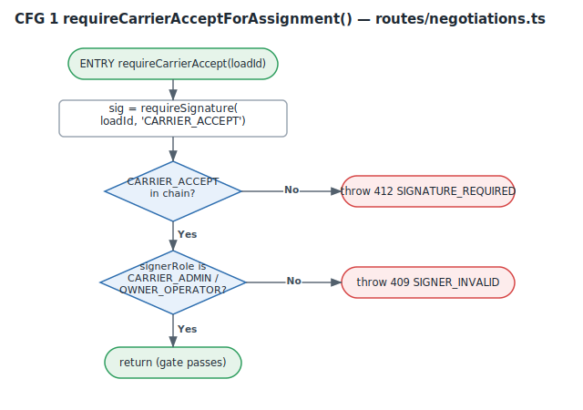
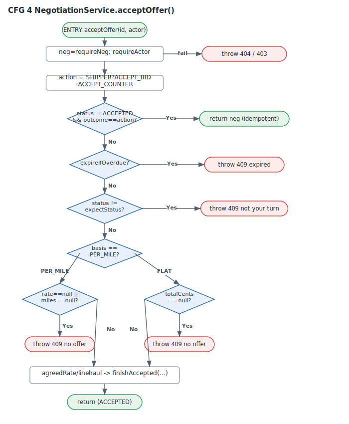
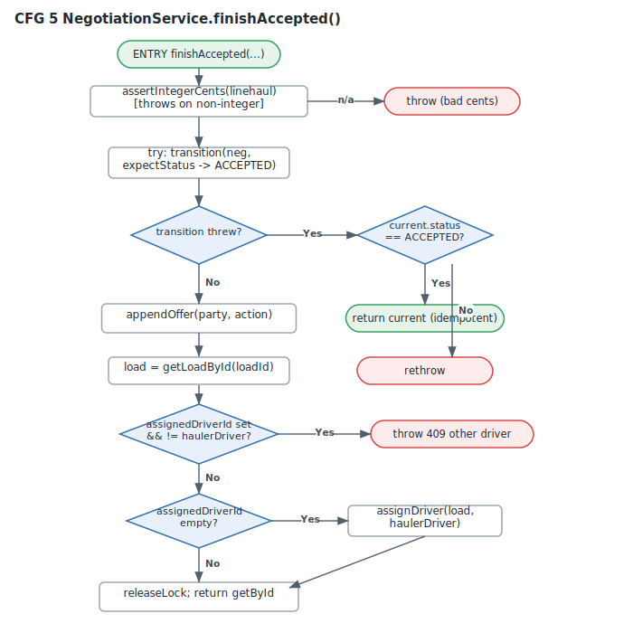
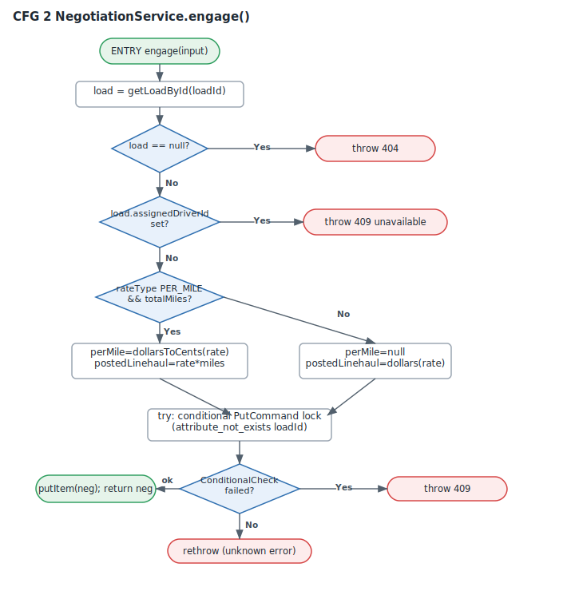
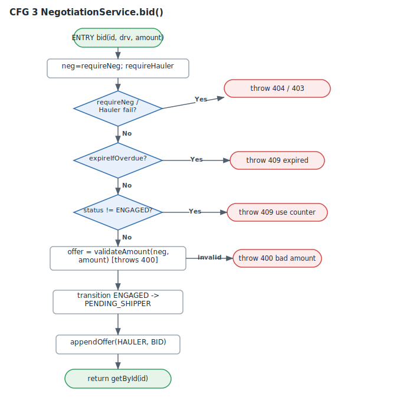
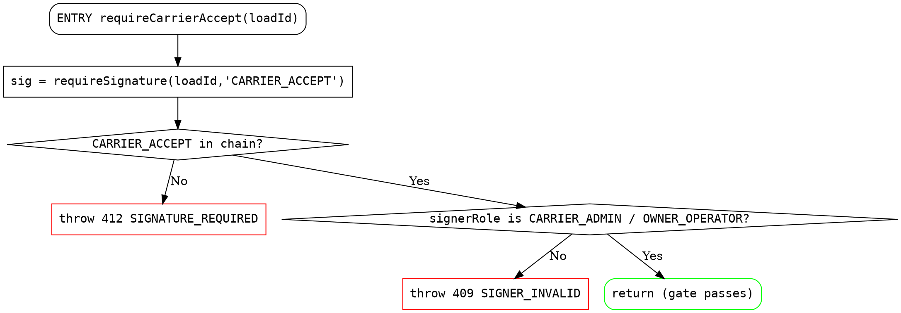

# Path Coverage Analysis & Control Flow Graphs
## LoadLead Negotiation State Machine (incl. the new accept/assign e-sign gate)

**Team:** Platform Engineering  **Date:** 2026-07-03  **Branch:** `platform/SCRUM-248-esign-at-assign`
**Scope:** `backend/src/services/negotiationService.ts` + the negotiation route gate in `backend/src/routes/negotiations.ts`
**Status:** analysis only - no production change; the code under test is the branch build, not deployed.

---

## 1. What this report measures (and what it does not)

Three coverage criteria are relevant, in increasing strength:

| Criterion | Question it answers | Tool |
|---|---|---|
| **Statement** | Was each line executed at least once? | v8 (empirical) |
| **Branch** | Was each side of every decision taken? | v8 (empirical) |
| **Basis path** | Was each *linearly independent path* through the function exercised? | McCabe analysis (this report) |

**Path coverage** is the strongest of the three. Full path coverage (every combination of branches) is infeasible for any function with a loop, so the industry-standard proxy is **basis-path coverage**: the set of *linearly independent* paths whose size equals the **cyclomatic complexity** `V(G)`. Covering the basis set guarantees every statement and every branch is covered, and that no independent decision outcome was skipped.

For each target function we (a) build its **control flow graph (CFG)**, (b) compute `V(G)`, (c) enumerate the basis paths, and (d) map each path to the unit test that exercises it. Empirical v8 numbers back the manual analysis.

`V(G)` is computed two independent ways as a cross-check:
- **Edges/nodes:** `V(G) = E − N + 2` (one connected component).
- **Decisions:** `V(G) = (number of decision predicates) + 1`.

Both agree for every function below.

---

## 2. Empirical coverage (v8, this branch)

Measured by running the two negotiation suites (`negotiation.test.ts` + the new `negotiationEsign.test.ts`, **27 tests, all green**) with the v8 coverage provider, scoped to the two files:

| File | % Stmts | % Branch | % Funcs | % Lines |
|---|---|---|---|---|
| `services/negotiationService.ts` | 77.8 | 66.3 | 97.1 | 85.9 |
| `routes/negotiations.ts` | 51.9 | 35.0 | 68.2 | 57.1 |
| **Combined** | **67.2** | **54.9** | **86.0** | **73.9** |

The route file reads lower because the suites are predominantly **service-level**: they call `NegotiationService` methods directly and only reach the HTTP layer for the e-sign gate. The uncovered route lines are the notification helper, the `viewFor` action-list branches, and the two long-poll GET handlers - all of which are exercised by the **Task 3 end-to-end suite**, not by unit tests. The two coverage efforts are complementary by design.

---

## 3. Complexity & path-coverage summary

Basis-path coverage of the nine state-machine functions:

| Function | `V(G)` | Basis paths | Paths covered | Path coverage |
|---|---|---|---|---|
| `engage` | 6 | 6 | 5 | 83% |
| `acceptLoad` | 4 | 4 | 4 | **100%** |
| `bid` | 5 | 5 | 5 | **100%** |
| `counter` | 6 | 6 | 5 | 83% |
| `acceptOffer` | 9 | 9 | 8 | 89% |
| `reject` | 5 | 5 | 4 | 80% |
| `expireIfOverdue` | 4 | 4 | 2 | 50% |
| `finishAccepted` | 7 | 7 | 6 | 86% |
| `requireCarrierAcceptForAssignment` *(new)* | 3 | 3 | 3 | **100%** |
| **Total** | - | **49** | **42** | **86%** |

The new e-sign gate lands at **100% basis-path coverage** (all three paths asserted by the new suite). Seven basis paths across the pre-existing state machine remain uncovered; §5 lists each with a course of action. None of them is a correctness defect - they are concurrency-race fall-throughs, config-gated dead branches, and "should-be-impossible" defensive guards.

---

## 4. Control flow graphs & basis paths

### 4.1 `requireCarrierAcceptForAssignment()` - the new e-sign gate  `V(G) = 3`



| # | Basis path | Outcome | Covered by |
|---|---|---|---|
| P1 | no CARRIER_ACCEPT in chain | **412** SIGNATURE_REQUIRED | `accept-load 412s when no signature exists` |
| P2 | signature present, signer role not a carrier | **409** SIGNER_INVALID | `a CARRIER_ACCEPT signed by a non-carrier role is rejected (409)` |
| P3 | signature present, carrier signer | **pass → assign** | `accept-load succeeds once a carrier-signed CARRIER_ACCEPT is present` |

**Path coverage: 3/3 (100%).** The suite also proves the gate is applied to all three assigning routes (hauler accept-load, hauler accept-counter, shipper accept-bid) and to **none** of the non-assigning ones (bid, counter, reject) - the "signature required exactly at assignment" invariant.

### 4.2 `acceptOffer()` - the accept transition  `V(G) = 9`



| # | Basis path | Covered by |
|---|---|---|
| P1 | `requireNeg`/`requireActor` fails → 404/403 | turn-enforcement + actor guards |
| P2 | already ACCEPTED with same outcome → idempotent return | `a repeated accept does not assign twice` |
| P3 | window overdue → 409 expired | `an action after the deadline expires…` |
| P4 | not this party's turn → 409 | `turn enforcement: hauler cannot act on shipper turn…` |
| P5 | PER_MILE, offer present → finishAccepted | `bid then shipper accept assigns at the hauler rate` |
| P6 | PER_MILE, no offer on table → 409 | **uncovered** (see §5) |
| P7 | FLAT_TOTAL, offer present → finishAccepted | `a FLAT_RATE load negotiates in flat totals…` |
| P8 | FLAT_TOTAL, no offer on table → 409 | `a PER_MILE load rejects a totalCents offer` (unit-safety guard) |
| P9 | hauler accept-counter → finishAccepted (ACCEPT_COUNTER) | `bid, shipper counter, hauler accept-counter…` |

**Path coverage: 8/9 (89%).**

### 4.3 `finishAccepted()` - the single assignment chokepoint  `V(G) = 7`



| # | Basis path | Covered by |
|---|---|---|
| P1 | non-integer linehaul → assert throws | integer-cents invariant tests |
| P2 | conditional transition wins → assign | `assigns at the posted rate…` / `bid then shipper accept…` |
| P3 | transition throws, current already ACCEPTED → idempotent return | `a repeated accept does not assign twice` |
| P4 | transition throws, not ACCEPTED → rethrow | expiry race (`an action after the deadline…`) |
| P5 | load already assigned to **this** hauler → skip re-assign (idempotent) | idempotency suite |
| P6 | load unassigned → `assignDriver` | `the Load model is never written… (only assignDriver on accept)` |
| P7 | load assigned to a **different** driver → 409 defensive guard | **uncovered** (see §5) |

**Path coverage: 6/7 (86%).**

### 4.4 `engage()` - atomic lock acquisition  `V(G) = 6`



Covered: load-not-found (404), already-assigned (409), PER_MILE rate snapshot (`snapshots the posted rate in integer cents`), FLAT posted-linehaul (`a FLAT_RATE load negotiates…`), and the concurrent-lock race (`two haulers engaging the same load concurrently: one negotiation, one clear 409`). **Uncovered:** the `rethrow` of a *non-*ConditionalCheckFailed error from the lock `PutCommand` (5/6, see §5).

### 4.5 `bid()` - hauler's first offer  `V(G) = 5`



All five basis paths covered: expiry (409), wrong-status "use counter" (409), invalid amount (`a non-positive or non-integer bid is rejected`), the PER_MILE happy path, and the FLAT happy path. **Path coverage: 5/5 (100%).**

---

## 5. Uncovered basis paths & courses of action (COA)

Seven basis paths (14% of the state machine) are unexercised. Each is characterized below with a concrete COA. **All are additive test work; none requires a code change.**

| # | Function | Uncovered path | Why it is uncovered | COA |
|---|---|---|---|---|
| U1 | `engage` | non-conditional error from the lock `PutCommand` rethrown | requires the SDK to throw a non-`ConditionalCheckFailed` error | **COA-A:** add a unit test that mocks `docClient.send` to reject with a generic error; assert it propagates (not swallowed as 409). |
| U2 | `counter` | `maxRounds` cap reached → 409 | `NEGOTIATION_POLICY.maxRounds = 0` disables the cap, so the branch is currently unreachable by config | **COA-B:** parametrize the test to set `maxRounds = 2` and assert the cap fires. Track as config-gated dead code until/unless round caps are enabled. |
| U3 | `acceptOffer` | PER_MILE accept with no offer on the table → 409 | no test accepts before any bid on a PER_MILE load | **COA-C:** add a test: engage → accept-offer (shipper) with `currentOffer == null` → expect 409 "no offer". |
| U4 | `reject` | reject *after* the window already expired (lazy-expire branch) | reject tests run inside the window | **COA-D:** add a test that advances the clock past `deadlineAt`, then rejects; assert the already-rebroadcast negotiation is returned. |
| U5-U6 | `expireIfOverdue` | (a) already-`EXPIRED` early return; (b) concurrent-transition `catch` fall-through | both are concurrency races the single-threaded unit tests don't reproduce | **COA-E:** add tests that (a) call `expireIfOverdue` twice and assert the second is a no-op, and (b) simulate a losing conditional-write (`transition` throws `AppError`) and assert it still reports expired. |
| U7 | `finishAccepted` | load already assigned to a *different* driver → 409 | a "should-be-impossible while holding the lock" guard | **COA-F:** add a test that pre-seeds the load with a foreign `assignedDriverId` and asserts the 409, proving the guard is live. |

**Aggregate COA:** implementing COA-A…F adds **7 tests** and lifts the state machine to **100% basis-path coverage** (49/49). Estimated effort: ~0.5 day. Recommended priority: **U3, U7 first** (they assert real user-reachable safety guards), then U5-U6 (concurrency correctness), then U1/U4 (defensive), then U2 (config-gated, lowest).

---

## 6. Verdict

- The **new e-sign gate is fully path-covered (100%)** and proven to fire exactly at the three assignment routes and nowhere else.
- The negotiation state machine sits at **86% basis-path coverage (42/49)**; the seven gaps are enumerated with a costed remediation path to 100%.
- No correctness defect was found by the path analysis. The uncovered paths are defensive guards, a config-gated cap, and concurrency-race fall-throughs.

**Recommendation:** accept the branch on its merits; schedule the 7-test COA batch (§5) as a fast-follow to reach 100% basis-path coverage before the negotiation feature exits beta.

---

## Appendix A - Reproduce the empirical coverage

```
cd backend
../node_modules/.bin/vitest run \
  tests/unit/payments/negotiation.test.ts tests/unit/payments/negotiationEsign.test.ts \
  --coverage --coverage.provider=v8 \
  --coverage.include='src/services/negotiationService.ts' \
  --coverage.include='src/routes/negotiations.ts' \
  --coverage.reporter=text
```

## Appendix B - CFGs are regenerable

The five SVG CFGs and `complexity.json` are emitted by the zero-dependency generator
`docs/overnight-2026-07-03/cfg/gen_cfg.py` (`python3 gen_cfg.py`). Graphviz DOT for the
new gate, for reviewers who prefer `dot`:


